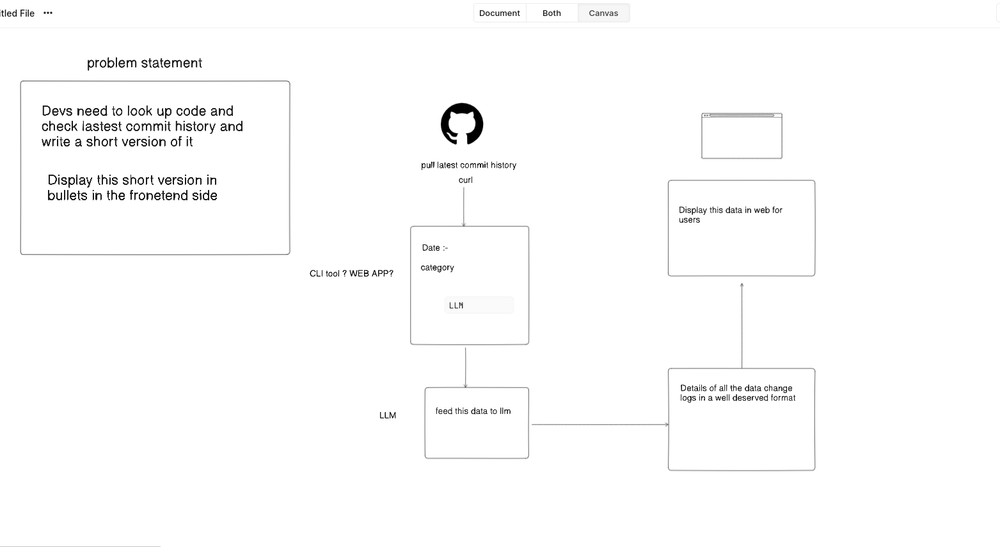

# Greptile assesment

### To create a change log generator

---

Languages and framework used

- Java with Spring Boot
- Meta Llama Vision Free
- thymeleaf with html

Reason for going with this is because I was already learning about spring so making projects with that would improve my spring knowledege

I can also build it using js and rust too.

Workflow diagram

## Steps how this works
- Pulls the commit history from github api
- feeds the data to free opensource LLM
- displays the changelog in ui

## How to Run

- Download the jar file and run using java -jar jarname
- Open localhost8080 and enter the details
- Give your github username example PrethamMuthappa
- Enter you Repo name (public repo for testing purpose)
- Enter no of commit history ( enter 1, as the free llm usually dont allow multiple requests)
- Results will be displayed

## Example

Result change logs

